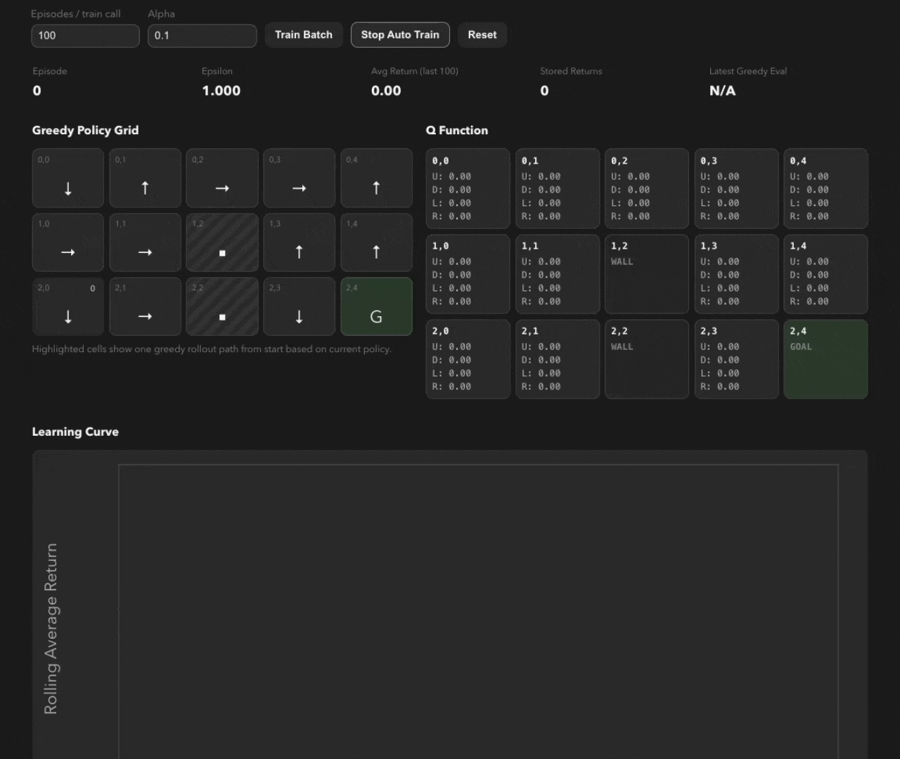

# Monte Carlo Control

A small RL project that trains an agent with Monte Carlo control + epsilon-greedy exploration in a custom grid world.

- Trains a Q-function with Monte Carlo updates.
- Uses epsilon-greedy action selection during training.
- Tracks both:
  - training return history
  - greedy evaluation return history (`epsilon = 0`)
- Visualizes policy, Q-values, and learning curves in the frontend.